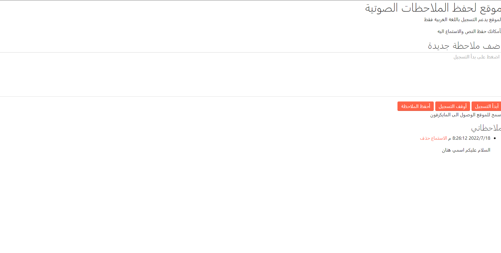

# text-to-speech
This code is used using HTML and JavaScript, to convert voice to writing,
Notes can also be saved with the date and time they were saved.
You can also save the text and listen to it

## Interface

## Technologies
Web APIs

## Reference
https://youtu.be/-k-PgvbktX4
